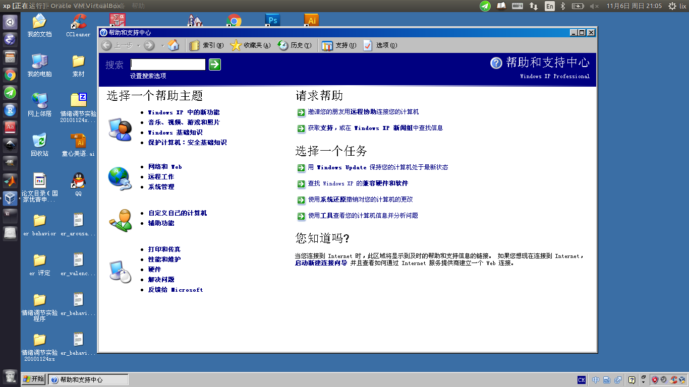
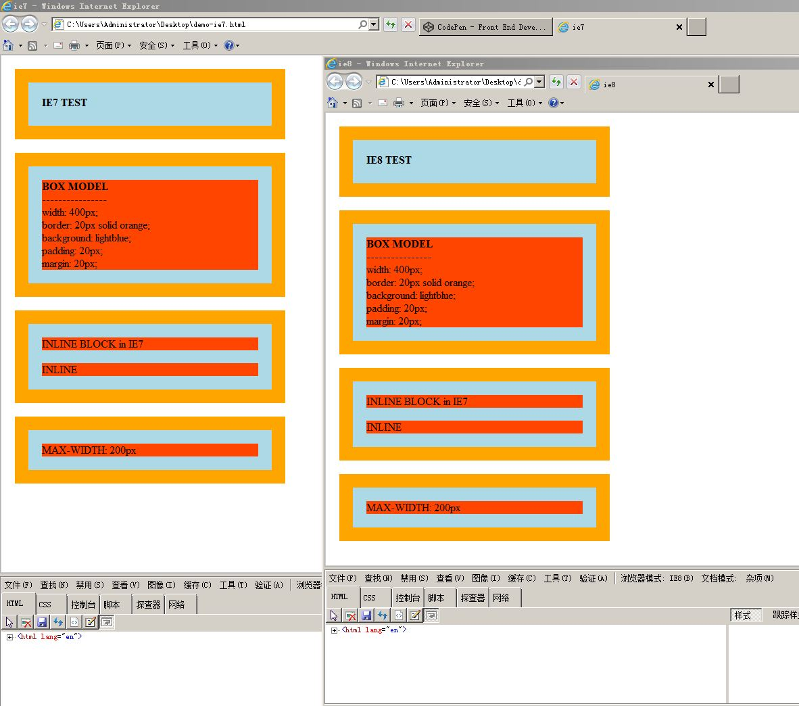
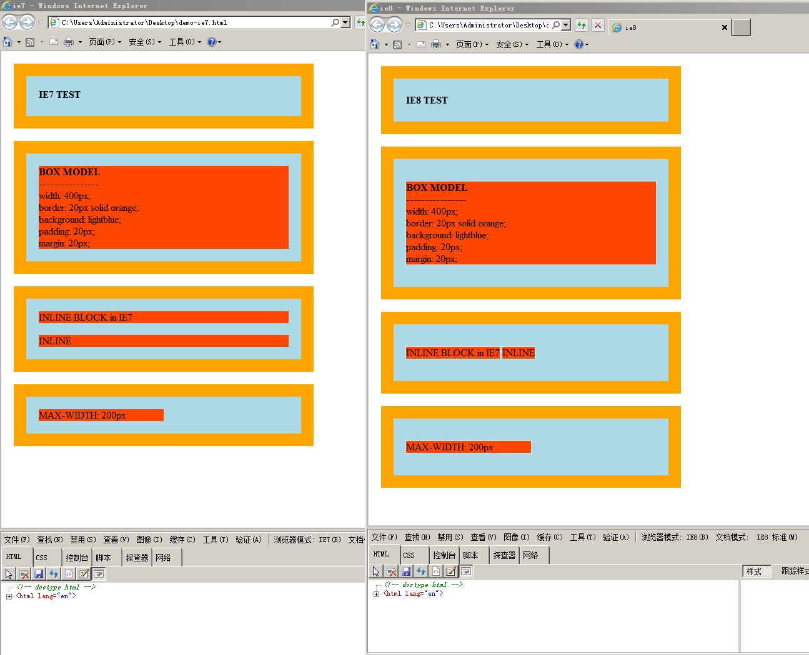

# 知识点必看 #

- [IE 盒模型 vs 标准盒模型](http://jscode.me/topic/314/%E7%9F%A5%E8%AF%86%E7%82%B9-ie-%E7%9B%92%E6%A8%A1%E5%9E%8B-vs-%E6%A0%87%E5%87%86%E7%9B%92%E6%A8%A1%E5%9E%8B)
- [当前中国各浏览器的市场占有率是多少？](http://tongji.baidu.com/data/browser)

# 问题 #

## 如何调试 IE 浏览器 ##

调试方法

1. IE 高版本有控制台
2. border: 1px solid red;
3. outline: 1px solid red;
4. 旧版本 javascript:alert(document.get...)

- 虚拟机安装 XP 系统
- 远程虚拟机
- ie tester（不靠谱）
- 某些 IE 可以开启浏览器模式（IE 10 可以测 IE9/8/7）

## 什么是 CSS hack？在 CSS 和 HTML 里如何写 hack？在 CSS 中 IE7、IE8 的 hack 方式？ ##

### CSS 与 HTML hack ###

因为不同浏览器对 CSS 的解析标准不一致，会导致页面呈现效果的不一致，所以需要针对不同浏览器去写不同的 CSS 样式，让它能兼容不同的浏览器。有时候需要使用非常规样式，来解决一些跨浏览器兼容的问题。

HTML 里可以使用条件注释来进行 hack。例如：

``` html
<!--[if IE 7]>
// 添加 CSS 样式
<![endif]-->
```

CSS hack：

1. 属性前缀法：例如 IE6 能识别下划线 `_` 和星号 `*`，IE7能识别星号 `*` ，但不能识别下划线""，IE6~IE10 都认识 `\9`，但 firefox 前述三个都不能认识。
2. 选择器前缀法：例如 IE6 能识别 `html .class{}`，IE7 能识别 `+html .class{}` 或者 `*:first-child+html` `.class{}`
3. IE 条件注释法：IE10+已经不再支持条件注释。

### IE7 ###

``` css
/* 选择器 hack */
.selector, {}` `.selector\ {}
*:first-child+html .selector {}
.selector, x:-IE7 {}
*+html .selector {}
body*.selector {}
html > /**/ body .selector {}
head ~ /**/ body .selector {}
/* 特性 hack */
.selector { property: value\9; }
.selector { property/*\**/: value\9; }
.selector { !property: value; }
.selector { $property: value; }
.selector { &property: value; }
.selector { *property: value; }
/* 媒体查询 */
@media screen\9 {}
```

### IE8 ###

``` css
/* 选择器 hack */
_::selection, .selector:not([attr*='']) {}
:root .selector {}
body:last-child .selector {}
body:nth-of-type(1) .selector {}
body:first-of-type .selector {}
.selector:not([attr*='']) {}
/* 特性 hack */
.selector { property: value\9; }
.selector { property/*\**/: value\9; }
/* 媒体查询 */
@media \0screen\,screen\9 {}
```

参考：[BrowserHacks](http://browserhacks.com/)

## 列举几种浏览器兼容问题 ##

- 不同浏览器盒模型标准不一致导致的问题
- hover 在低版本 IE 上失效问题
- inline-block 的兼容问题
- ul 和 ol 列表缩进问题
- CSS 透明度问题
- 元素水平居中问题

参考资料：

- [47种常见的浏览器兼容性问题大汇总](http://www.w3cfuns.com/notes/18372/bf9885f9902262654cd4d12cd1b65a11)
- [浏览器兼容性问题汇总及解决方案](http://blog.csdn.net/lmb55/article/details/50950901)

## 针对兼容、多浏览器覆盖有什么看法？渐进增强和优雅降级是什么意思？ ##

对于浏览器兼容性需要考虑两个问题：

1. 是否需要兼容 IE？定百分比，淘宝 >3% 就兼容。
2. 兼容到什么程度？设计稿和网页稿不一定百分之百，兼容是需要分级的。

很多时候考虑到成本和收益，并不需要满足所有浏览器下100%的兼容。这样是不现实的。应该根据现实需求，渐进得进行兼容。

### 渐进增强和优雅降级 ###

在设定的基准线上的增强叫做渐进增强，在此之下的兼容叫优雅降级。
> 优雅降级（graceful degradation）：一开始就构建站点的完整功能，然后针对浏览器测试和修复 ps: 比如一开始使用 css3 的特性构建了一个应用，然后逐步针对各大浏览器进行 hack 使其可以在低版本浏览器上正常浏览。
> 渐进增强（progressive enhancement）：一开始就针对低版本浏览器进行构建页面，完成基本的功能，然后再针对高级浏览器进行效果、交互、追加功能达到更好的体验。

## reset.css 和 normalize.css 分别是做什么的？为什么推荐使用 normalize.css? ##

[reset.css](http://meyerweb.com/eric/tools/css/reset/)

reset.css 完全移除了浏览器内置的样式，然后再手动添加。

> The goal of a reset stylesheet is to reduce browser inconsistencies in things like default line heights, margins and font sizes of headings, and so on.

> CSS resets aim to remove all built-in browser styling. Standard elements like H1-6, p, strong, em, et cetera end up looking exactly alike, having no decoration at all. You're then supposed to add all decoration yourself.

[normalize.css](https://necolas.github.io/normalize.css/)

normalize.css 目的在于使得内置浏览器的样式在浏览器之间保持一致性。

> Normalize.css makes browsers render all elements more consistently and in line with modern standards. It precisely targets only the styles that need normalizing.

> Normalize CSS aims to make built-in browser styling consistent across browsers. Elements like H1-6 will appear bold, larger et cetera in a consistent way across browsers. You're then supposed to add only the difference in decoration your design needs.

Normalize.css VS reset.css

- normalize.css **保存了部分可用的默认样式**：reset.css为几乎所有元素统一了样式风格，但normalize保存了一些有用的默认样式。
- normalize.css **修复了一些 bug**：normalize 修复了一些常见的 PC 端及移动端的 bug，这往往超出了 reset 的能力范围，这里包括了 HTML5 元素的显示设置，修正了预格式化文本的字体问题，在 IE9 上的 SVG overflow 问题以及不同浏览器和操作系统与表单之间的问题。
- normalize.css **不会使你的调试工具混乱**：在页面中调试样式的时候，如果使用了 reset.css，在样式调试区域就会出现大量的继承属性链，但 normalize.css 并不会出现这个问题，因为它的样式规则使用的是具有针对性的样式及相对保守的使用多重选择器。
- normalize.css 可以**模块化**：normalize 可以被分成多个独立的部分，也就是说你可以指定你自己需要的默认样式，同时，你的项目不需要哪些样式，可以对其进行删除。
- normalize 提供了大量的**文档**：normalize 的代码基于非常细致的跨浏览器的研究和系统的测试，在[项目页](https://github.com/necolas/normalize.css)上面提供了详细的注释，这样你就能知道每行代码做了什么，为啥它会被包含进来，以及浏览器之间的差异，还有就是更容易你自己去进行测试。

参考资料：

- [normalize.css与reset.css区别](https://www.w3ctech.com/topic/1804)
- [What is the difference between Normalize.css and Reset CSS?](http://stackoverflow.com/questions/6887336/what-is-the-difference-between-normalize-css-and-reset-css)
- [来，让我们谈一谈 Normalize.css](http://jerryzou.com/posts/aboutNormalizeCss/)


## IE 盒模型和标准盒模型有什么区别? 怎样使 IE7、8 使用标准盒模型? box-sizing: border-box 有什么作用 ##

IE 盒模型的 width 和 height 包括了内容、内边距和边框，而标准盒模型只包括内容宽高，内边距和边框不计算在内。

`box-sizing: border-box;` 用来改变默认的 `content-box` 盒模型内容宽高计算方式为 `border-box`，即包括了内边距和边框。

# 操作 #

virtualbox 安装 xp 虚拟机
[mac](http://blog.sina.com.cn/s/blog_56d895ee010149q6.html)
[windows](http://www.2363.net/JiaoCheng/162.html)

在 IE 7、8 中展示盒模型、inline-block、max-width 的区别



## IE 7,8 比较

### 声明 doctype ###



### 不声明 doctype ###



# 参考 #

- [CSS Tools & Techniques](http://www.teaching-materials.org/csstools/)
- [知乎：怎样可以很好地保证网页的浏览器兼容性](https://www.zhihu.com/question/19736007)
- [让我们谈一谈 Normalize.css](http://jerryzou.com/posts/aboutNormalizeCss/)
- [知乎: Normalize.css 与传统的 CSS Reset 有哪些区别](https://www.zhihu.com/question/20094066)
